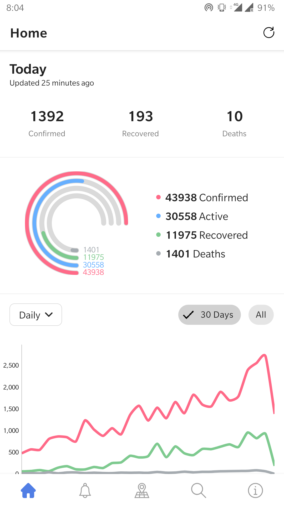
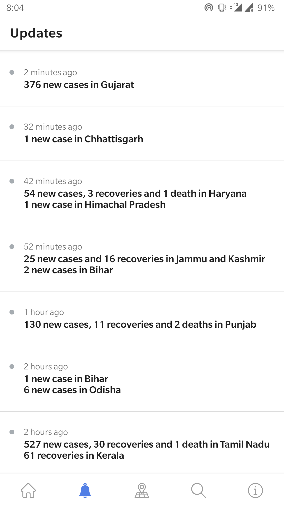
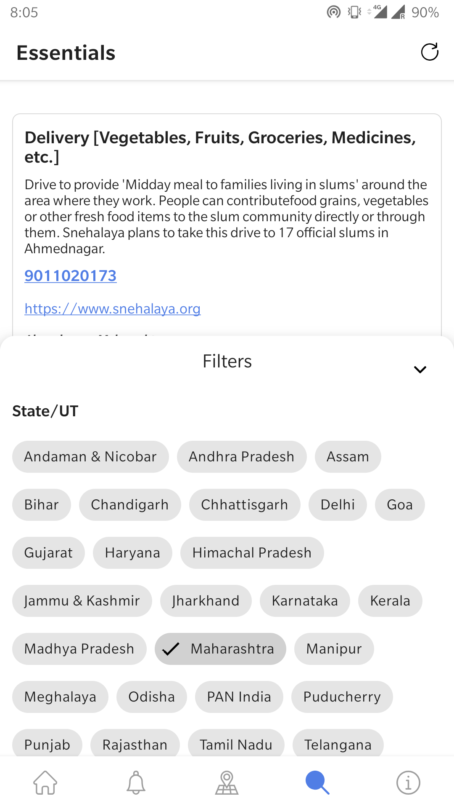
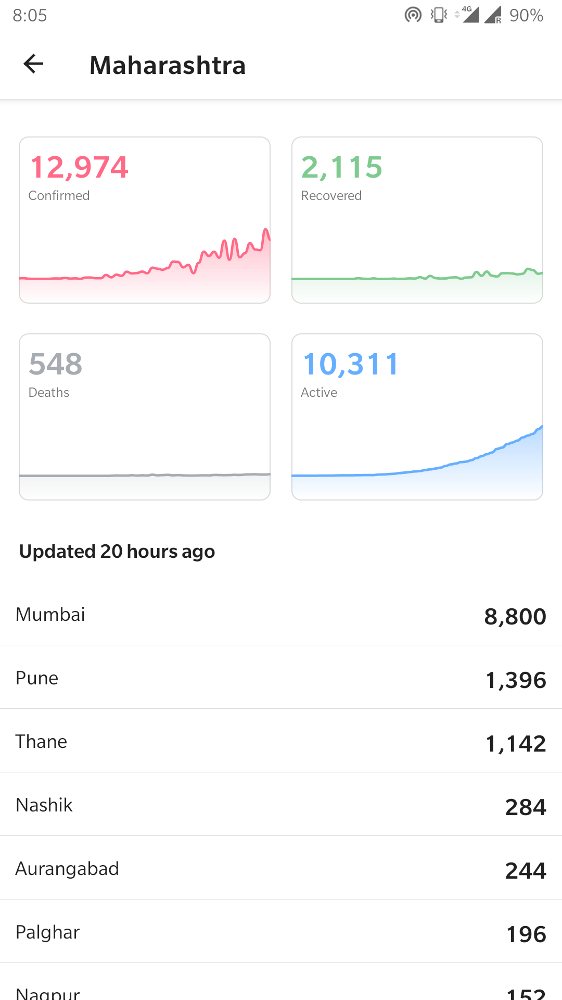
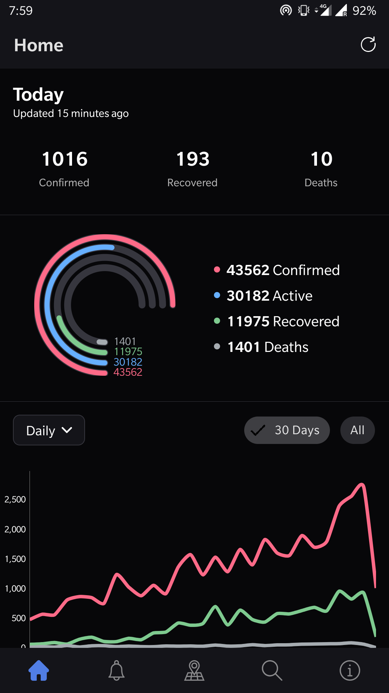
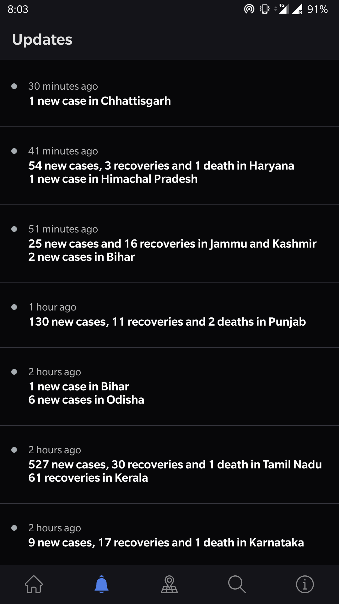
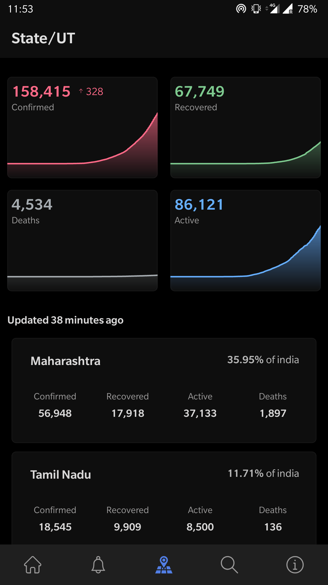
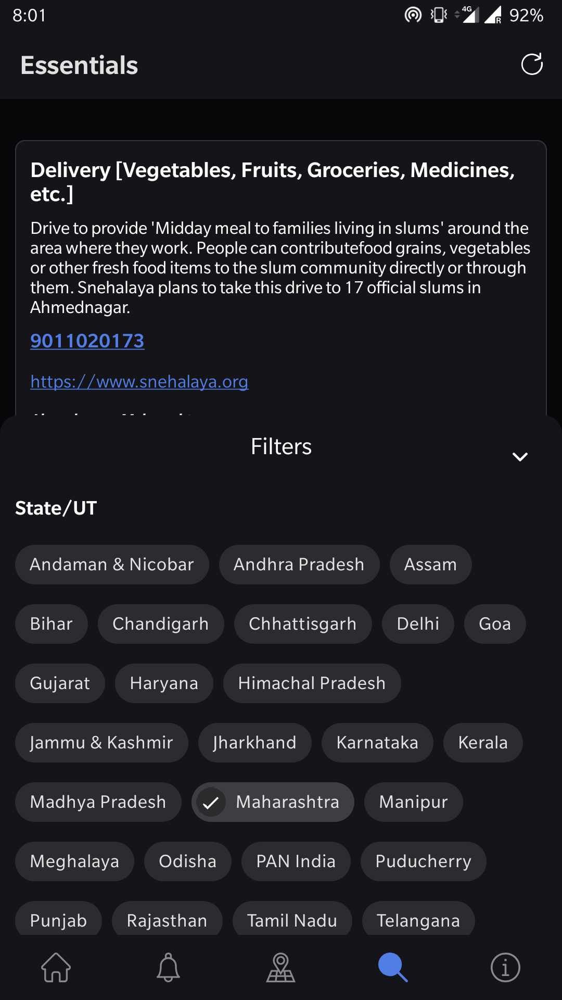
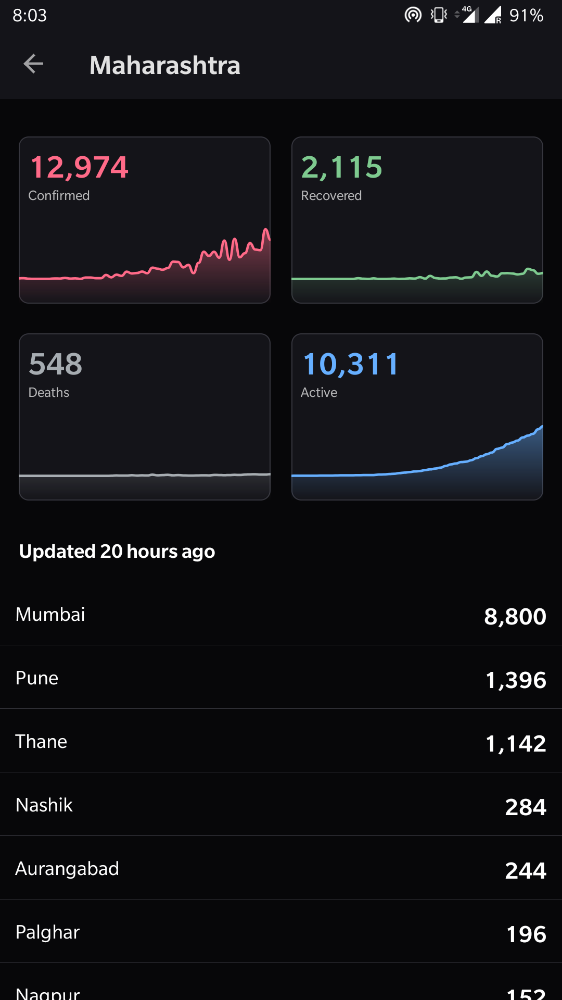

# COVID-19 Tracker Android Application
This application displays the latest updates based on numbers from https://www.covid19india.org/

## 

    

### Dark Mode
     

## Required Permissions
    android.permission.INTERNET

## Libraries
- Kotlin
- Koin
- MVVM Architecture
- Material Design
- AndroidX
- Kotlin Coroutines
- Retrofit 2
- Moshi JSON Parser 
- Android Architecture Component

## Contributions

If you've found an error in this project, please file an issue.

Patches are encouraged, and may be submitted by forking this project and
submitting a pull request. Since this project is still in development,
if your change is substantial, please raise an issue.

# Credits
Thanks to [COVID19India.org](https://github.com/covid19india/api) for open-source API.

## Maintainer
Mehatab Shaikh <shaikh.mehatab@gmail.com>

Crash Reporting
---------------

Provided [for free](https://www.bugsnag.com/open-source) by

